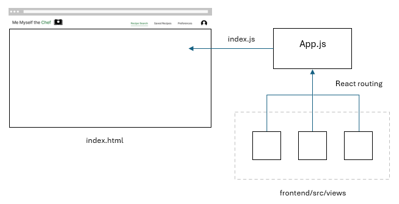

# Me-Myself-the-Chef

This document is intended to serve as an entry point to understand the project supporting the Me Myself the Chef website. It describes:
* How to initialise and run the web application locally 
* How to access the deployed web application 
* The purposes and files contained in each major directory within the code base
* How the frontend and backend servers are structured
* Files not committed to the project repository
* The project versioning strategy 
* The project pull request strategy

Github repository link: https://github.com/Monash-FIT3170/Me-Myself-the-Chef 

## Local Running

To run the web app on a local machine, follow the steps below. 

### Initialisation Steps

1.	Install Node.js on the host computer
2.	Obtain a valid Spoonacular API key
    * Visit https://spoonacular.com/food-api and register for an API key, or use an existing key
3.	Obtain a valid Gemini API key
    * For instructions, see https://ai.google.dev/gemini-api/docs/api-key
4.	Obtain the project code base (either by cloning the repository or manually receiving the files)
5.	cd to the `backend` directory in the command line
6.	Run `npm install` to install backend dependencies
7.	Create a file name `.env` in the `backend` directory and fill the file with the following lines, substituting your API keys where indicated:
```
SPOONACULAR_API_KEY=<YOUR_SPOONACULAR_API_KEY>
GEMINI_API_KEY =<YOUR_GEMINI_API_KEY>
```
8.	cd to the `frontend` directory
9.	Run `npm install` to install frontend dependencies
10. In the .env file in the `frontend` directory, replace the first line with: 
```
REACT_APP_BACKEND_URL=https://localhost:8080
```
### Running Steps
1.	cd to the `backend` directory in the command line
2.	Run `npm run dev`
3.	cd to the `frontend` directory
4.	Run `npm start`
5.	The web app should be launched in your browser. If not, visit `http://localhost:3000/<desired_route>`

## Deployment 

The app is currently deployed on cloud platforms on free tier plans. 

The front end is deployed using Netlify and can be accessed through this link: https://celebrated-axolotl-0c9cf8.netlify.app/ 

The back end is deployed using Render and can be reached through this link: https://me-myself-the-chef.onrender.com 

As the back end server is deployed on a Render free plan, the server will go into a sleep mode if the back end is not contacted for a certain amount of time, and the server will take approximately 1 minute to spin up from inactivity. So, using any functionality of the app relying on the backend immediately from an inactive state will likely result in errors. Please give the app some time after the initial page load before use. 

The deployment is currently configured to deploy the servers from the main branch automatically after an update. To obtain the access credentials to the Netlify and Render accounts for this app, please contact the team by sending an email to chef@memyselfthechef.eml.monster . This email will remain active for up to a year after project completion. 
 

## Directory Structure

Below is the main directory structure of the main branch of the repository. Descriptions for folders and files are put in parentheses (no directory or file names contain parentheses or spaces). Descriptions are omitted when a folder or file’s purpose is deemed obvious.

* backend
    * config (configuration information files for user authentication and database systems)
    * controllers (defines controllers to handle routes)
    * middleware (middleware files to support user authentication)
    * models (schema files for backend objects)
    * routes (declares routes that are handled and what controllers handle them) 
    * server.js (entry point file for the backend server)
    * package.json (backend project metadata and dependencies)
    * packge-lock.json (locks versions of backend dependencies)
* frontend
    * public (resource directory accessible to React components during run time)
        * index.html (base HTML file for React to root from)
        * static (static web resources to access)
    	* fonts
        * html_pages
        * images
    * src (React JSX systems)
        * components (React components used to make pages)
        * context (React context system to share information between pages)
        * utils (Holds default user preferences)
        * css
        * views (React pages to be displayed inside the index.html template)
    * App.js (base React app component to display the web pages in frontend/src/views via routing)
    * index.js (loads the base React app into the index.html template)
    * package.json (frontend project metadata and dependencies)
    * package-lock.json (locks versions of frontend dependencies)
    * .env (specifies backend endpoint URL) 


## Project Architecture Overview

Me Myself the Chef is implemented as a web application using the MERN stack. This web app is run using 2 servers, a front end React server and a back end Express server.

### Front End
The front end React server is a single page application, meaning it only loads a single web page internally (in index.js) but dynamically rewrites the page data to display new content, including different pages for different web addresses. It does so using React routing, a React module to display different React components for different paths. This is done in App.js, which serves as the single React component that is displayed which changes based on the accessed path. The different React components showing page content to be displayed in App.js are stored in frontend/src/views.



The front end server was initialised using the create-react-app library. This provided quick and thorough setup of dependencies, but means that certain configuration settings are hidden in its associated node_modules files, such as the entry point JS file. As the node_modules folder is listed in the .gitignore file, edits to these config files will not be tracked by Git. Please do not eject create-react-app config files without discussing with the team. For further information on this, see https://stackoverflow.com/questions/44403923/how-does-react-create-app-react-scripts-find-the-entry-point .

### Back End
The back end Express server functions to support API calls from the front end to handle user authentication and API calls to the 3rd party service we use for recipe generation, Spoonacular, as well as the Gemini service for the chatbot. The back end server handles front end API calls by:
* Declaring routes that the server will handle in the files found in backend/routes, and assigning routes with controllers to handle them
* Implementing controllers in backend/controllers to act on an API call from the front end

## .gitignore
The main files/directories set to be uncommitted to the repository are:
* frontend/node_modules : front end dependencies (too many small files)
* backend/node_modules : back end dependencies (too many small files)
* backend/.env : stores Spoonacular and Gemini API key 
   * Spoonacular API key on free tier has limited uses of 50/day
   * Gemini API key in free tier has limited calls (15 requests/minute, 1500 requests/day)

The required node_modules dependency files can be installed by running `npm install` inside the frontend and backend directories.
The .env file containing the Spoonacular and Gemini API keys must be named .env and populated with the lines below (replacing the API keys where indicated):
```
SPOONACULAR_API_KEY=<YOUR_API_KEY>
GEMINI_API_KEY=<YOUR_API_KEY>
```
See the initialisation instructions in this document for how to add these files/directories to your local repository.

## Versioning Strategy 

The versioning strategy for Me Myself the Chef is based on semantic versioning, which is a system where a number with three parts is used. The first number is the major version, the second is the minor version, and the third is for patches. The major number should be increased when making a very significant change, the minor number should be increased when making a smaller change, and patch is for very small changes such as fixing bugs. 

We will start at version 1.0.0 when Milestone 4 is completed. 

## Pull Request Strategy 

As no further work on this project is currently planned by the team, pull requests made to work on the Me Myself the Chef app will not be monitored. 

However, it is possible for anyone to fork the project and make a copy of the app for their own purposes. To do this, go to the project code repository, and click the "Fork" button near the top right of the page. For further information, please read the Maintenance Plan. 


## Team Members

- Xiao Hao Zheng (29493641): xzhe0014@student.monash.edu
- Eilish Horsfall (31578039): ehor0012@student.monash.edu
- Shekah Alayadhi (32248407): shekah0023@student.monash.edu
- Yuhan Zhou (31468748): yzho0151@student.monash.edu
- Shekah Alayadhi (32248407): sala0023@student.monash.edu
- Emily Jap (29680433): emil0009@student.monash.edu
- Vincent Ha (32518714): vhaa0001@student.monash.edu
- Lachlan Lu (33107327): lluu0029@student.monash.edu
- Annie Ho (3156581): ahoo0034@student.monash.edu
- Kevin Cody (31491898): kcod0001@student.monash.edu
- Alana Vanzo (31458394): avan0035@student.monash.edu
- Ashley Warden (32473354): awar0023@student.monash.edu
- Ray Lin (33156859): rlin0032@student.monash.edu
- Daniel Truong (33158312): dtru0010@student.monash.edu
- Joseph Ti (29274281): jtii0002@student.monash.edu
- Thomas Pang (31474578): tpan0022@student.monash.edu
- Terence Bai (33157642): tbai0012@student.monash.edu
